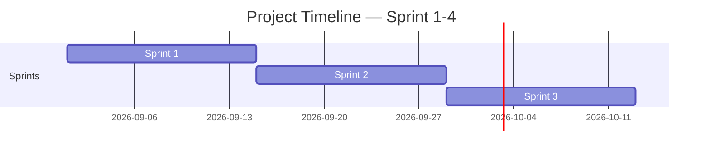

<!-- Template เต็มไฟล์สำหรับสร้าง docs/agile/02-sprint-backlog.md -->

<!-- ภาพรวมว่า Story ไหนไปอยู่ Sprint ไหนตลอด 4 Sprint — ไม่ต้องระบุคนรับผิดชอบ/Status ที่นี่ ส่วนนั้นอยู่ใน sprint-plan-[NN].md ของ Sprint ที่กำลังทำ -->

# Sprint Backlog

**Version:** 1.0 | **Last Updated:** 2026-09-01

> ภาพรวมว่า User Story ไหนจาก `01-product-backlog.md` จะไปอยู่ Sprint ไหน — Sprint ที่ยังไม่ถึงคือ draft คร่าวๆ ปรับได้เสมอเมื่อเข้าใจงานมากขึ้น

## Timeline (4 Sprint, Sprint ละ 2 สัปดาห์)

| Sprint   | เริ่ม | สิ้นสุด |
| -------- | ---------- | -------------- |
| Sprint 1 | 2026-09-01 | 2026-09-14     |
| Sprint 2 | 2026-09-15 | 2026-09-28     |
| Sprint 3 | 2026-09-29 | 2026-10-12     |

> ปรับวันที่ให้ตรงกับวันที่ทีมเริ่มลงมือทำจริง (ถ้าไม่ใช่วันแลปนี้)

## Sprint 1 (กำลังทำ)

| # | User Story                                                                                              | MoSCoW    | Estimate (SP) |
| - | ------------------------------------------------------------------------------------------------------- | --------- | ------------- |
| 1 | As an player, I want more level and monster, so that I came across a new challenge and more aesthetic | Must Have | 6             |
| 2 | As a player, I want to scroll inventory tab, so that I can select any items in inventory tab            | Must Have | 4             |
| 3 | As a player, I want to see more detail of each items                                                    | Must Have | 6             |
| 4 | As a player, I want to see character move and attack smoothly, realistiic                               | Must Have | 8             |

## Sprint 2 (Draft)

| # | User Story                                                                                              | MoSCoW    | Estimate (SP) |
| - | ------------------------------------------------------------------------------------------------------- | --------- | ------------- |
| 1 | As a monster, I want to attack, so that I can hurt the player                                           | Must Have | 8             |
| 2 | As a items, I want to pick up, so that I can use their ability.                                         | Must Have | 4             |
| 3 | As an player, I want more level and monster, so that I came across a new challenge and more aesthetic | Must Have | 6             |
| 4 | As a player, I want to see more detail of each items                                                    | Must Have | 6             |

## Sprint 3 (Draft)

| # | User Story                                                                                   | MoSCoW      | Estimate (SP) |
| - | -------------------------------------------------------------------------------------------- | ----------- | ------------- |
| 1 | As a any object, I want to interact with them, so that I can get a hint.                    | Must Have   | 2             |
| 2 | As a player, I want to scroll inventory tab, so that I can select any items in inventory tab | Must Have   | 4             |
| 3 | As a player, I want to see my damage, so that I know how close monsters to die               | Should Have | 3             |

## Sprint 4 (Draft)

| # | User Story                                                   | MoSCoW       | Estimate (SP) |
| - | ------------------------------------------------------------ | ------------ | ------------- |
| 1 | As a designer, I want enemy spawn rate stored in a data file | Nice to Have | 3             |

> **Sprint 2-4 คือ draft ระดับ release plan** — เป้าหมายคือฝึกกะจำนวน SP ต่อ Sprint ให้ใกล้เคียง capacity ของทีม ไม่ใช่ล็อก scope ตายตัว ปรับได้ทุกครั้งที่ทำ Sprint Planning ของ Sprint ถัดไป
>
> เมื่อ Sprint ไหนเริ่มทำงานจริง ให้คัดลอก template `sprint-plan-template.md` (ไฟล์แนบใน LMS) ไปสร้าง `docs/agile/sprint-plan-[NN].md` แล้วดึง Story ของ Sprint นั้นจากตารางด้านบนมาใส่คนรับผิดชอบ แตก Task และปรับ Estimate ให้ละเอียดขึ้น

## Links

- [[docs/agile/01-product-backlog|Product Backlog]]
- [[docs/agile/sprint-plan-01|Sprint 1 Plan]]
