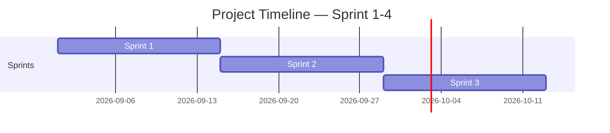

# **วันที่ประชุม:** 2026-09-22 | **Sprint:** Sprint 2

### Story 1 — UI & Checkpoint Rules

- [ ] เขียนโค้ดเพิ่มแถบช่องเก็บของ และเพิ่มจุดเกิดของผู้เล่นถ้าตาย [owner:: Atithap] [domain::
  programmer] [estimate:: 6h] [status:: In progress]

### Story 2 — Painting others assets in level 1 & 2 Visuals

- [ ] ลงสีดีเทลเพิ่มเติมของ Assets กับ Background Level 1 [owner:: Alisa] [domain::
  artist01] [estimate:: 8h] [status:: In progress]

### Story 3 — New background for level 2 & Assets Design

- [ ] ออกแบบ Tilemap พื้นหลังด่านที่ 2 [owner:: Chanokchon] [domain:: designer]
  [estimate:: 4h] [status:: In progress]

### Story 4 — Platform level 1 & Items Visuals

- [ ] วาด Platform สำหรับ Level 1 และ Items [owner:: Pitcharpa]
  [domain:: artist02] [estimate:: 5h] [status:: In progress]

<!-- Template เต็มไฟล์สำหรับสร้าง docs/agile/02-sprint-backlog.md -->

<!-- ภาพรวมว่า Story ไหนไปอยู่ Sprint ไหนตลอด 4 Sprint — ไม่ต้องระบุคนรับผิดชอบ/Status ที่นี่ ส่วนนั้นอยู่ใน sprint-plan-[NN].md ของ Sprint ที่กำลังทำ -->

# Sprint Backlog

**Version:** 1.0 | **Last Updated:** 2026-09-22

> ภาพรวมว่า User Story ไหนจาก `01-product-backlog.md` จะไปอยู่ Sprint ไหน — Sprint ที่ยังไม่ถึงคือ draft คร่าวๆ ปรับได้เสมอเมื่อเข้าใจงานมากขึ้น

## Timeline (4 Sprint, Sprint ละ 2 สัปดาห์)

| Sprint   | เริ่ม | สิ้นสุด |
| -------- | ---------- | -------------- |
| Sprint 1 | 2026-09-23 | 2026-09-29     |
| Sprint 2 | 2026-09-30 | 2026-10-14     |
| Sprint 3 | 2026-10-15 | 2026-11-02     |

> ปรับวันที่ให้ตรงกับวันที่ทีมเริ่มลงมือทำจริง (ถ้าไม่ใช่วันแลปนี้)

## Sprint 1 (กำลังทำ)

| # | User Story                                                                                             | MoSCoW    | Estimate (SP) |
| - | ------------------------------------------------------------------------------------------------------ | --------- | ------------- |
| 1 | As a player, I want more level and monster, so that I came across a new challenge and more aesthetic | Must Have | 6             |
| 2 | As a player, I want to scroll inventory tab, so that I can select any items in inventory tab           | Must Have | 4             |
| 3 | As a player, I want to see more detail of each items                                                   | Must Have | 6             |
| 4 | As a player, I want to see character move and attack smoothly, realistiic                              | Must Have | 8             |

## Sprint 2 (Draft)

| # | User Story                                                                                                       | MoSCoW    | Estimate (SP) |
| - | ---------------------------------------------------------------------------------------------------------------- | --------- | ------------- |
| 1 | As a new monster in level 2, I want to attack, so that I can hurt the player                                     | Must Have | 8             |
| 2 | As a items, I want to pick up, so that I can use their ability.                                                  | Must Have | 4             |
| 3 | As an player, I want more level and monster, so that I came across a new challenge and more aesthetic          | Must Have | 6             |
| 4 | As a player, I want to see more detail of each items, so that I can seperate types items of them                 | Must Have | 6             |
| 5 | As a designer, I want player has a checkpoint locate for each level, so that I can spawn where the place I spawn | Must Have | 6             |

## Sprint 3 (Draft)

| # | User Story                                                                                   | MoSCoW      | Estimate (SP) |
| - | -------------------------------------------------------------------------------------------- | ----------- | ------------- |
| 1 | As papers of story, I want to interact with them, so that I can get a hint.                 | Must Have   | 2             |
| 2 | As a player, I want to scroll inventory tab, so that I can select any items in inventory tab | Must Have   | 4             |
| 3 | As a player, I want to see monster's hp bar, so that I know how close monsters to die        | Should Have | 3             |

## Sprint 4 (Draft)

| # | User Story                                                   | MoSCoW       | Estimate (SP) |
| - | ------------------------------------------------------------ | ------------ | ------------- |
| 1 | As a designer, I want enemy spawn rate stored in a data file | Nice to Have | 3             |

> **Sprint 2-4 คือ draft ระดับ release plan** — เป้าหมายคือฝึกกะจำนวน SP ต่อ Sprint ให้ใกล้เคียง capacity ของทีม ไม่ใช่ล็อก scope ตายตัว ปรับได้ทุกครั้งที่ทำ Sprint Planning ของ Sprint ถัดไป
>
> เมื่อ Sprint ไหนเริ่มทำงานจริง ให้คัดลอก template `sprint-plan-template.md` (ไฟล์แนบใน LMS) ไปสร้าง `docs/agile/sprint-plan-[NN].md` แล้วดึง Story ของ Sprint นั้นจากตารางด้านบนมาใส่คนรับผิดชอบ แตก Task และปรับ Estimate ให้ละเอียดขึ้น

## Links

- [[docs/agile/01-product-backlog|Product Backlog]]
- [[docs/agile/sprint-plan-01|Sprint 1 Plan]]

---

# Sprint [2] Plan

**Sprint Goal:** [เพิ่มเติม Assets, Background, New UI, Checkpoint ในตัว Prototype]
**ระยะเวลา:** [2026-09-22] — [2026-09-29]
**Team:** [1.682110109 ชนกชนม์ หมดมลทิน / 2.682110135 พิชชาภา ชมภูมิ่ง / 3.682110151 อติเทพ ป้องนานาค / 4.682110155 อลิสา ใจสิทธิ์]

---

## Sprint Backlog

| # | User Story                                                                                                       | MoSCoW    | Estimate (SP) | Status         |
| - | ---------------------------------------------------------------------------------------------------------------- | --------- | ------------- | -------------- |
| 1 | As a new monster in level 2, I want to attack, so that I can hurt the player                                     | Must Have | 8             | 🔲 Todo        |
| 2 | As a items, I want to pick up, so that I can use their ability.                                                  | Must Have | 4             | 🔲 Todo        |
| 3 | As a player, I want to see more detail of each items, so that I can seperate types items of them                 | Must Have | 6             | 🔄 In Progress |
| 4 | As a designer, I want player has a checkpoint locate for each level, so that I can spawn where the place I spawn | Must Have | 6             | 🔄 In Progress |

## Status Legend

- 🔲 Todo
- 🔄 In Progress
- ✅ Done
- ❌ Blocked

---

## Tasks 1

### Story 1 — [As a new monster in level 2, I want to attack, so that I can hurt the player]

- [X] [หาไอเดีย เรฟ]  [owner:: ชนกชนม์ หมดมลทิน]  [estimate:: 4]  [status:: Done]
- [X] [ออกแบบเลเวลและมอนสเตอร์]  [owner:: ชนกชนม์ หมดมลทิน]  [estimate:: 5]  [status:: Done]
- [ ] [เลือกพาเลทสี สไตล์ ธีม ลงสี]  [owner:: อลิสา ใจสิทธิ์]  [estimate:: 8]  [status:: In Progress]
- [ ] [เพื่อนในกลุ่มแสดงความคิดเห็น และรับฟีดแบ็ค]  [owner:: อลิสา ใจสิทธิ์]  [estimate:: 4]  [status:: In Progress]

## Tasks 2

### Story 2 — [As a items, I want to pick up, so that I can use their ability.]

- [X] [หาไอเดีย เรฟ สำหรับลักษณะช่องไอเท็ม]  [owner:: ชนกชนม์ หมดมลทิน]  [estimate:: 4]  [status:: Done]
- [X] [เลือกพาเลทสี สไตล์ ธีม ลงสี]  [owner:: ชนกชนม์ หมดมลทิน]  [estimate:: 5]  [status:: Done]
- [ ] [เขียนโค้ด วางกลไกการทำงาน]  [owner:: อติเทพ ป้องนานาค]  [estimate:: 8]  [status:: In Progress]
- [ ] [เพื่อนในกลุ่มแสดงความคิดเห็น และรับฟีดแบ็ค]  [owner:: อติเทพ ป้องนานาค]  [estimate:: 4]  [status:: In Progress]

## Tasks 3

### Story 3 — [As a player, I want to see more detail of each items, so that I can seperate types items of them]

- [X] [หาไอเดีย เรฟ สำหรับแต่ละไอเท็ม ]  [owner:: พิชชาภา ชมภูมิ่ง]  [estimate:: 3]  [status:: Done]
- [X] [เลือกพาเลทสี สไตล์ ธีม]  [owner:: พิชชาภา ชมภูมิ่ง]  [estimate:: 5]  [status:: Done]
- [ ] [ลงสี เพิ่มรายละเอียด]  [owner:: พิชชาภา ชมภูมิ่ง]  [estimate:: 7]  [status:: In Progress]
- [ ] [เพื่อนในกลุ่มแสดงความคิดเห็น และรับฟีดแบ็ค]  [owner:: พิชชาภา ชมภูมิ่ง]  [estimate:: 4]  [status:: In Progress]

## Tasks 4

### Story 4 — [As a designer, I want player has a checkpoint locate for each level, so that I can spawn where the place I spawn]

- [X] [หาไอเดีย เรฟ สำหรับการเคลื่อนไหวของตัวละคร]  [owner:: ชนกชนม์ หมดมลทิน]  [estimate:: 2]  [status:: Done]
- [X] [เลือกพาเลทสี สไตล์ ธีม]  [owner:: อลิสา ใจสิทธิ์]  [estimate:: 6]  [status:: Done]
- [ ] [เขียนโค้ด วางกลไกการทำงาน]  [owner:: อติเทพ ป้องนานาค]  [estimate:: 8]  [status:: In progress]
- [ ] [เพื่อนในกลุ่มแสดงความคิดเห็น และรับฟีดแบ็ค]  [owner:: อลิสา ใจสิทธิ์]  [estimate:: 4]  [status:: In Progress]
