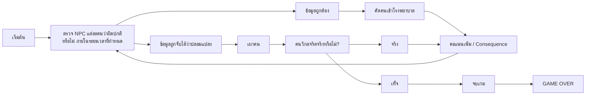

# [dernière] — Core Loop & Gameplay [682110135, 682110155]

## Core Loop

## Core Mechanics

1. ตรวจสอบข้อมูลในเอกสารกับตัวจริงว่าแมตช์กันหรือไม่
2. เผาคนถูกรึเปล่า?

## Controls

| Key          | Action          |
| ------------ | --------------- |
| A D          | Move            |
| Space        | Open a file     |
| E            | File is correct |
| Q            | File is fake    |
| [อื่นๆ] | [action]        |

## Win / Lose Condition

- **ชนะเมื่อ:** [คัดคนวิกลจริตออกจากคนปกติทั้งหมดได้สำเร็จ]
- **แพ้เมื่อ:** [ปล่อยให้คนวิกลจริตเข้าสู่ค่ายกักกัน]
