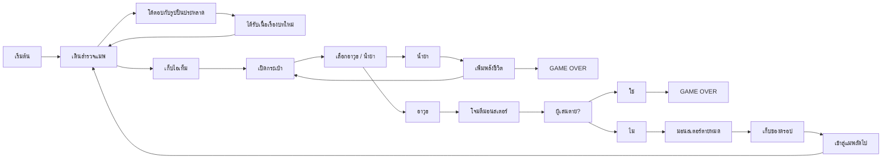

# [Melanie] — Core Loop & Gameplay [682110135, 682110155]

## Core Loop

```mermaid
flowchart LR
    A[เริ่มต้น] --> B[เดินสำรวจแมพ]
    B --> C[โต้ตอบกับรูปปั้นประหลาด]
    C --> D[ได้รับเนื้อเรื่องบทใหม่]
    D --> B
    B --> G[เก็บไอเท็ม]
    G --> E[เปิดกระเป๋า]
    E --> H[เลือกอาวุธ / น้ำยา]
    H --> I[อาวุธ]
    I --> F[โจมตีมอนสเตอร์]
    H --> J[น้ำยา]
    J --> K[เพิ่มพลังชีวิต]
    K --> E
    K --> L[GAME OVER]
    F --> M[ผู้เล่นตาย?]
    M --> R[ใช่]
    M --> Q[ไม่]
    R --> S[GAME OVER]
    Q --> N[มอนสเตอร์ตายหมด]
    N --> O[เก็บของดรอป]
    O --> P[เข้าสู่แมพถัดไป]
    P --> B
```

## Core Mechanics

1. เก็บไอเท็ม เพื่อไขปริศนา
2. Challenge ความยากของมอนสเตอร์ โดยใช้ทักษะการเล่นของผู้เล่น

## Controls

| Key          | Action                    |
| ------------ | ------------------------- |
| A D          | Move                      |
| T            | Open inventory            |
| E            | Interact items or monster |
| Space        | Jump                      |
| Double Space | Double Jump               |

## Win / Lose Condition

- **ชนะเมื่อ:** [เอาชนะ Final Boss เพื่อรับกุญแจทางออกได้สำเร็จ]
- **แพ้เมื่อ:** [ผู้เล่นเสียชีวิต]
