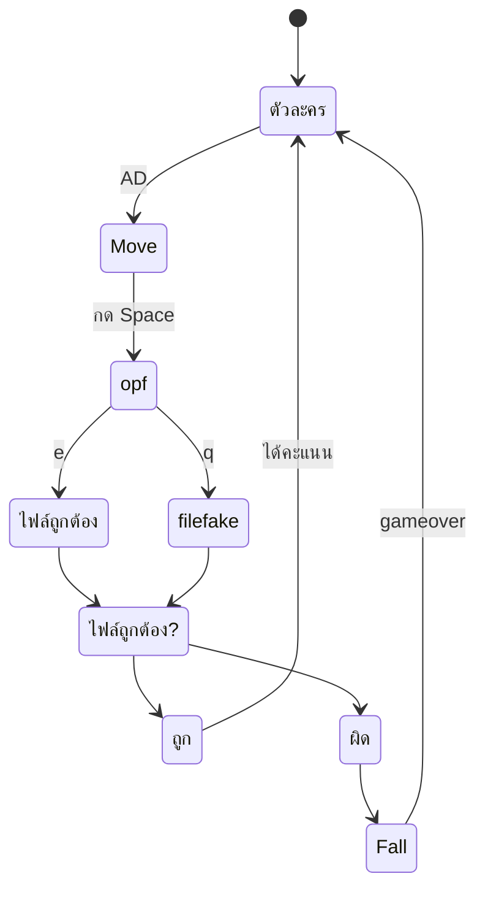

# Mechanic Design — [ชื่อ Mechanic]

## State Diagram

## Rules

| State          | เข้าเงื่อนไข                        | ออกเงื่อนไข                         | Note             |
| -------------- | ----------------------------------------------- | ---------------------------------------------- | ---------------- |
| ตัวละคร | เริ่มเกม / หยุดเคลื่อนที่ | กด input ใดๆ                              | Animation loop   |
| Move           | กดปุ่มทิศทาง                        | ปล่อยปุ่ม / เลื่อนหน้าจอ | Speed = [ค่า] |
| OPF            | กด Space เพื่อเปิดไฟล์           | E / Q                                          | -                |
