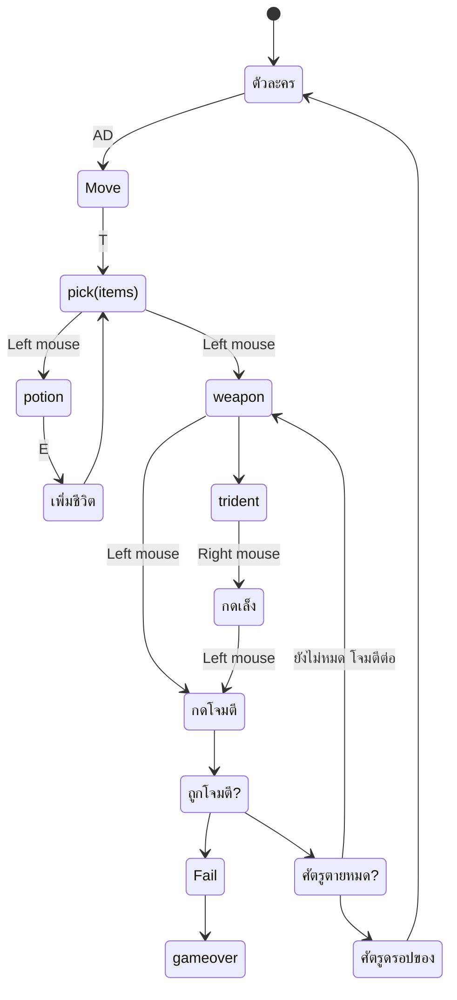

# Mechanic Design — [Attacking]

## State Diagram

```mermaid
stateDiagram-v2
    [*] --> ตัวละคร
    ตัวละคร --> Move : AD
    Move --> pick(items) : T
    pick(items) --> weapon : Left mouse
    pick(items) --> potion : Left mouse
    potion --> เพิ่มชีวิต : E
    เพิ่มชีวิต --> pick(items)
    weapon --> กดโจมตี : Left mouse
    weapon --> trident
    trident --> กดเล็ง : Right mouse
    กดเล็ง --> กดโจมตี : Left mouse
    Fail --> gameover
    กดโจมตี --> ถูกโจมตี?
    ถูกโจมตี? --> Fail
    ถูกโจมตี? --> ศัตรูตายหมด?
    ศัตรูตายหมด? --> weapon : ยังไม่หมด โจมตีต่อ
    ศัตรูตายหมด? --> ศัตรูดรอปของ
    ศัตรูดรอปของ --> ตัวละคร
  
```

## Rules

| State          | เข้าเงื่อนไข                        | ออกเงื่อนไข                         | Note                       |
| -------------- | ----------------------------------------------- | ---------------------------------------------- | -------------------------- |
| ตัวละคร | เริ่มเกม / หยุดเคลื่อนที่ | กด input ใดๆ                              | Animation loop             |
| Move           | กดปุ่มทิศทาง                        | ปล่อยปุ่ม / เลื่อนหน้าจอ | Speed = [ค่า]           |
| Pick items     | กด Tเพื่อเปิดช่องเก็บของ  | กด T ซ้ำอีกครั้ง                  | -                          |
| Aim Target     | กดค้าง Right mouse                        | กด Right mouse อีกครั้ง              | รูปทิศทาง trident |
|                |                                                 |                                                |                            |
