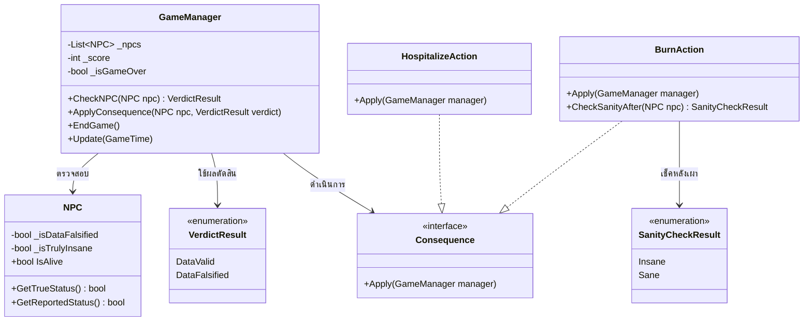

# Class Diagram — [dernière]

```mermaid
classDiagram
    class GameManager {
        -List~NPC~ _npcs
        -int _score
        -bool _isGameOver
        +CheckNPC(NPC npc) VerdictResult
        +ApplyConsequence(NPC npc, VerdictResult verdict)
        +EndGame()
        +Update(GameTime)
    }

    class NPC {
        -bool _isDataFalsified
        -bool _isTrulyInsane
        +bool IsAlive
        +GetTrueStatus() bool
        +GetReportedStatus() bool
    }

    class VerdictResult {
        <<enumeration>>
        DataValid
        DataFalsified
    }

    class Consequence {
        <<interface>>
        +Apply(GameManager manager)
    }

    class HospitalizeAction {
        +Apply(GameManager manager)
    }

    class BurnAction {
        +Apply(GameManager manager)
        +CheckSanityAfter(NPC npc) SanityCheckResult
    }

    class SanityCheckResult {
        <<enumeration>>
        Insane
        Sane
    }

    GameManager --> NPC : ตรวจสอบ
    GameManager --> VerdictResult : ใช้ผลตัดสิน
    GameManager --> Consequence : ดำเนินการ
    HospitalizeAction ..|> Consequence
    BurnAction ..|> Consequence
    BurnAction --> SanityCheckResult : เช็คหลังเผา
```
